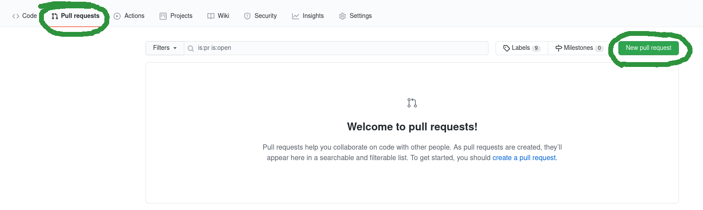
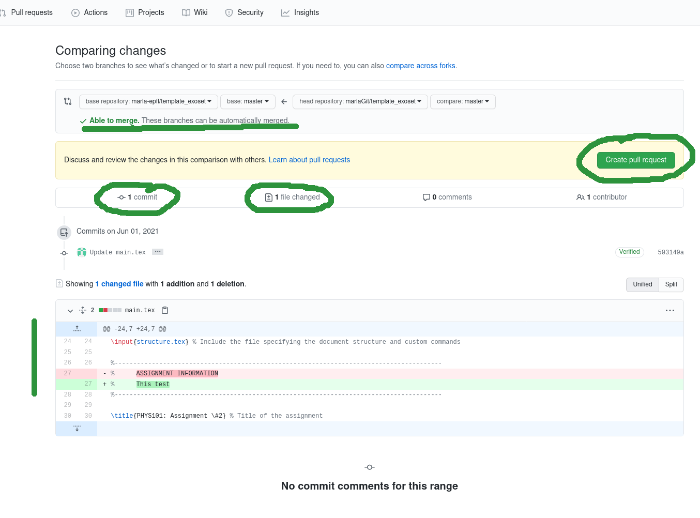

 .. _gitHub:

Pull request
======================================================================

This section will explain how to make a pull request. A pull request consists in submitting the changes made to the
 main repository's administrator. Every pull request must pass some test, but please before submitting verify that
at least your latex compiles.
Log in into GITHUBWEB_ and go to your fork (url should look like https://github.com/YOUR_USERNAME/YOUR_FORK)

* Select the menu «Pull request» → click on new pull request. A screen which compares the changes is shown,
  you can see the list of your commits, which files have been changed

* Click on «Create pull request» verify your comment and confirm clicking on «Create pull request»

* Doing so you will be redirected to the administrator repository and verify the status (only the administrator can
 validate and merge your changes in the main repository). After few minutes you can check if your code have passed the
 test, if so a green check is shown. Still review required and merging is blocked (action done by the administrator).

    * Administrator can leave a comment. The comment is shown automatically under your own comment. This is just a comment
    * Administrator can ask for change, you can change the files / add comment, the administrator will see what you have done.
      Checks re-runs automatically
    * Administrator can approve your changes after the above operation or approve directly your changes, once approved,
      the administrator can merge your pull request → Doing so, the administrator repository will be updated

**Administrator can approve your changes after the above operation or approve directly your changes, once approved,
the administrator can merge your pull request → Doing so, the administrator repository will be updated**

.. _GITHUBWEB: https://github.com
