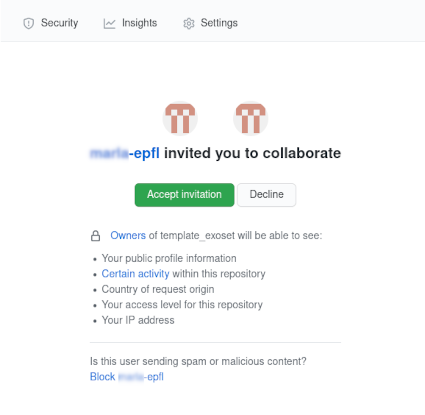
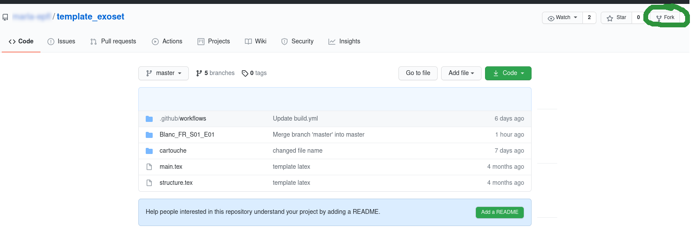

 .. _start_collaborating:

Start collaborating
======================================================================

This section will explain how to use GitHub for collaborating on exoset project. Before starting please create an account
on GitHub with your EPFL email if you do not have one.

The administrator will send you an invitation to collaborate to the exoset repository. Please accept the pending invitation
as shown in the figure

After accepting the invitation you have the rights to collaborate to the repository exoset. The first thing to do is to
fork the exoset repository. A fork is a copy of a repository that you manage. Forks let you make changes to a project
without affecting the original repository. You can fetch updates from or submit changes to the original repository
with pull requests.
To fork the repository simply click on fork (on the top right) when viewing the exoset repository as show in the figure and follow the instruction:

Forking a repository is similar to copying a repository, with two major differences:

* You can use a pull request to suggest changes from your user-owned fork to the original repository, also known as the
  upstream repository.
* You can bring changes from the upstream repository to your local fork by synchronizing your fork with the upstream repository.

The next section will explain how to work with the latex files

