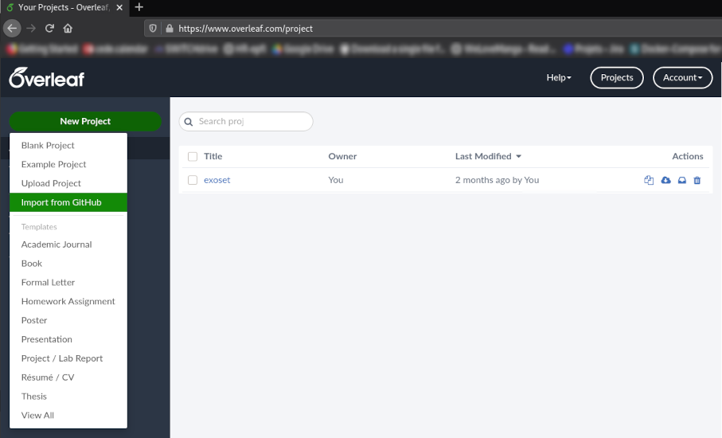
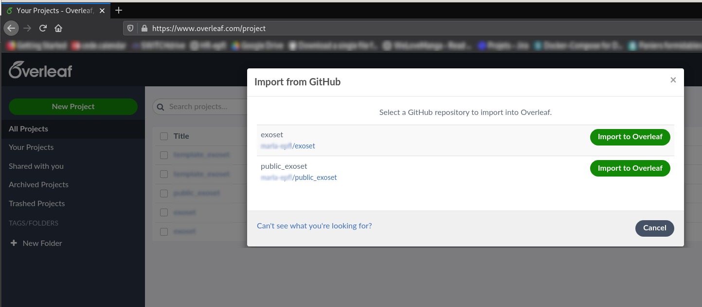
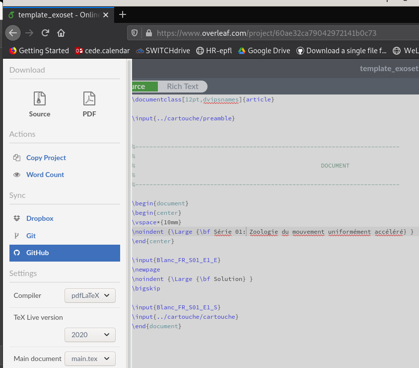
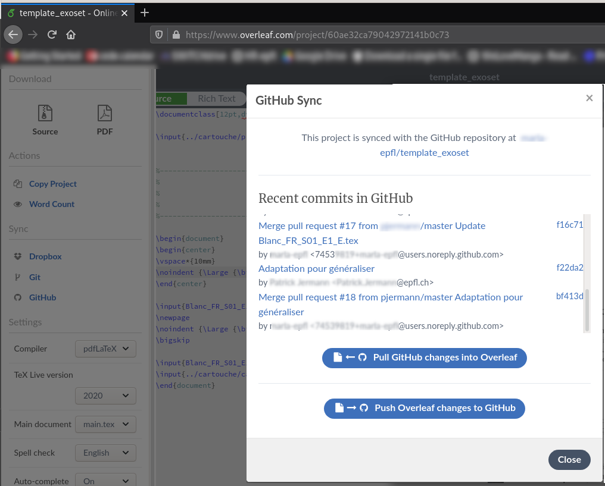
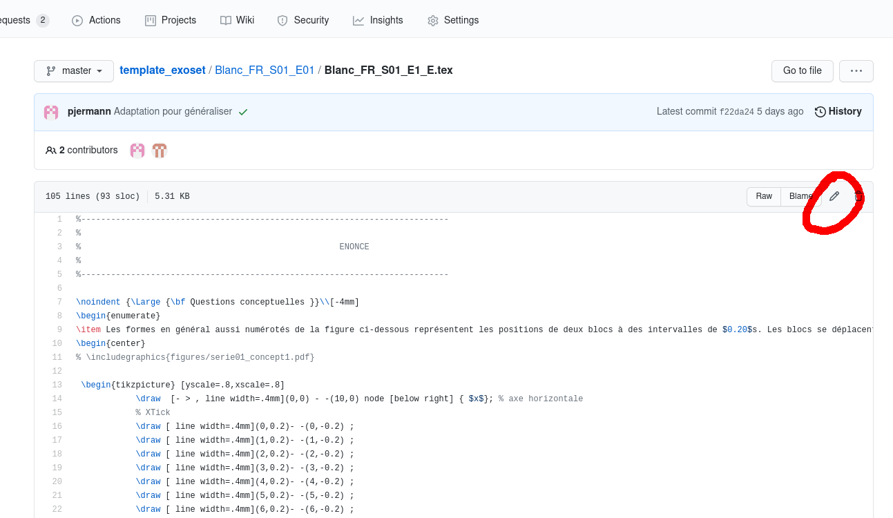
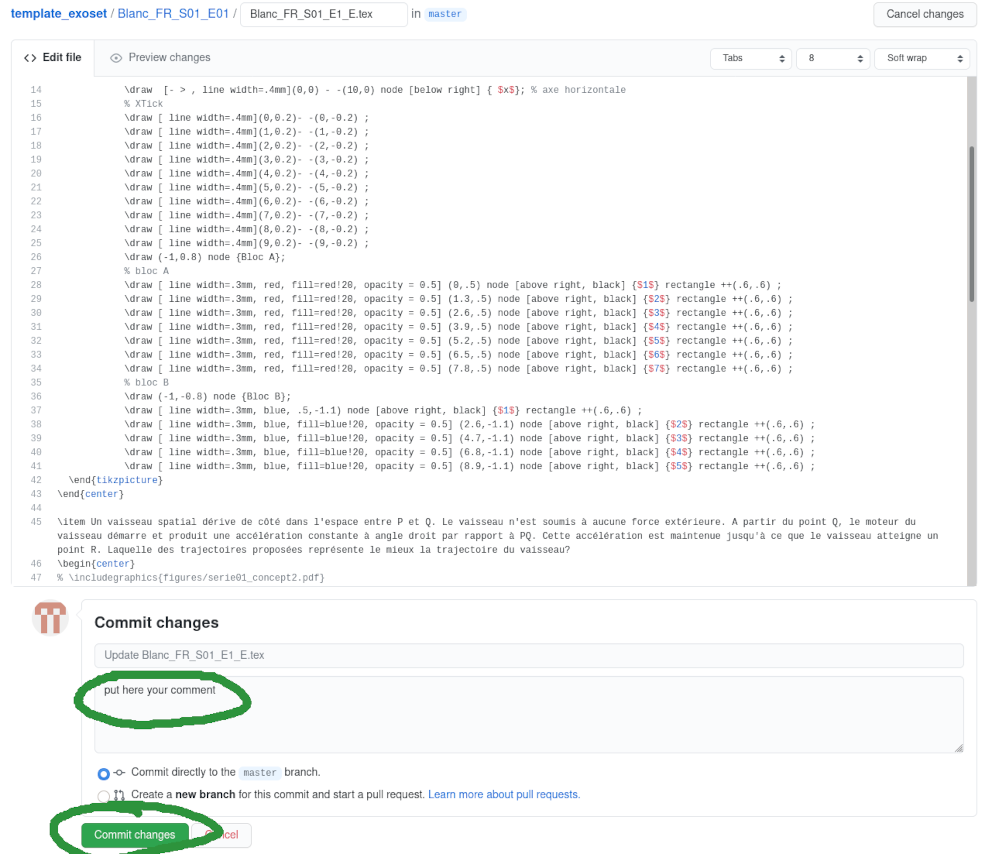

 .. _gitHub/work_with_latex:

######################
Work with Latex files
######################

This section describes how a collaborator can work with the latex files. A collaborator can either create or modify
exercises. A collaborator can also delete an exercise.
All these actions must pass through a pull request and being validated by the administrator of the repository after
passing tests. Before submitting a pull request a collaborator can modify a forked repository using three ways:

Overleaf
--------

To use overleaf with all the functionalities you must use your EPFL account.
Go to OVERLEAF-EPFL_ and log in with your EPFL account. You must then link your overleaf account with the one from gitHub.
To do so, once connected into the overleaf platform go

1.  On the left side menu click on "New project" → "Import from GitHub" and select the right repository. The pop-up will
show all the repository linked to your account

2. Before start working be sure your folder is updated, to do so click on "Menu" (on top left) and select "GitHub" under
the submenu "Sync". Verify that your repository is not "behind" and pull all the changes

3. Now that you are updated you can start working on the exercises using overleaf, create, modify and or delete files,
compile them and solve the eventual problem.

4. When you finished or you want to save your modification on your personal GiHub repository follow the step 2, make a pull if Overleaf
suggests you and then click on Push Overleaf changes to GitHub. Follow the suggestions to leave a comment for the commit.
In doing so, you will save a version of your work on GitHub with a commit.

From now on you do not need to create a new project every time you go on Overleaf, you just need to select the right project
and **remember to synchronise your Overleaf project and your gitHub repository, this step is not automatic and solving
conflicts is not easy if you are new.**

Locally with Git
----------------

If you are familiar with Git and you want to work offline this is your solution. To work with Git you need to follow these
steps:

1. Clone your forked repository by clicking on "Code" and selecting SSH or HTTPS

.. code-block:: shell

     $ git clone https://github.com/YOUR_USERNAME/YOUR_FORK.git

.. figure:: figures/https-url-clone-cli.png
   :alt: Clone forked repository

2. Configure Git to synchronize your forked repository with the original repository. Go to your local repository and
verify the current remote configured. If it corresponds to your forked repository then add upstream

.. code-block:: shell

    $ git remote -v
    > origin  https://github.com/YOUR_USERNAME/YOUR_FORK.git (fetch)
    > origin  https://github.com/YOUR_USERNAME/YOUR_FORK.git (push)
    $ git remote add upstream https://github.com/ORIGINAL_OWNER/ORIGINAL_REPOSITORY.git
    $ git remote -v
    > origin    https://github.com/YOUR_USERNAME/YOUR_FORK.git (fetch)
    > origin    https://github.com/YOUR_USERNAME/YOUR_FORK.git (push)
    > upstream  https://github.com/ORIGINAL_OWNER/ORIGINAL_REPOSITORY.git (fetch)
    > upstream  https://github.com/ORIGINAL_OWNER/ORIGINAL_REPOSITORY.git (push)

3. Syncing the fork. Fetch the branches and their respective commits from the upstream repository.
    * Commits to BRANCHNAME will be stored in the local branch upstream/BRANCHNAME.

    .. code-block:: shell

        $ git fetch upstream
        > remote: Counting objects: 75, done.
        > remote: Compressing objects: 100% (53/53), done.
        > remote: Total 62 (delta 27), reused 44 (delta 9)
        > Unpacking objects: 100% (62/62), done.
        > From https://github.com/ORIGINAL_OWNER/ORIGINAL_REPOSITORY
        >  * [new branch]      main     -> upstream/main

    * Check out your fork's local default branch - in this case, we use main.

    .. code-block:: shell

        $ git checkout main
        > Switched to branch 'main'

    * Merge the changes from the upstream default branch - in this case, upstream/main - into your local default
      branch. This brings your fork's default branch into sync with the upstream repository, without losing your local changes.

    .. code-block:: shell

        $ git merge upstream/main
        > Updating a422352..5fdff0f
        > Fast-forward
        >  README                    |    9 -------
        >  README.md                 |    7 ++++++
        >  2 files changed, 7 insertions(+), 9 deletions(-)
        >  delete mode 100644 README
        >  create mode 100644 README.md

4. Now you can start working on your files. Use your latex editor to edit/create/delete files
5. Make your commit

.. code-block:: shell

    $ git commit -m "your comment"

6. Make a pull

.. code-block:: shell

    $ git pull

7. Finally push your commits to your forked repository

.. code-block:: shell

    $ git push

If you cloned via HTTPS username and password will be always asked, if you want to connect without typing username and
password, use SSH. Next time you need to start from step 3.

GitHub
------

**This method is suggested only if you are familiar with gitHub interface or you need to slightly modify few files**

1. Select the file you want to change
2. On the top right click on the pencil icon

3. Modify the file with the GitHub text editor
4. Scroll down and make your comment for the commit
5. To save your work click on "Commit changes"

.. _OVERLEAF-EPFL: https://overleaf.com

